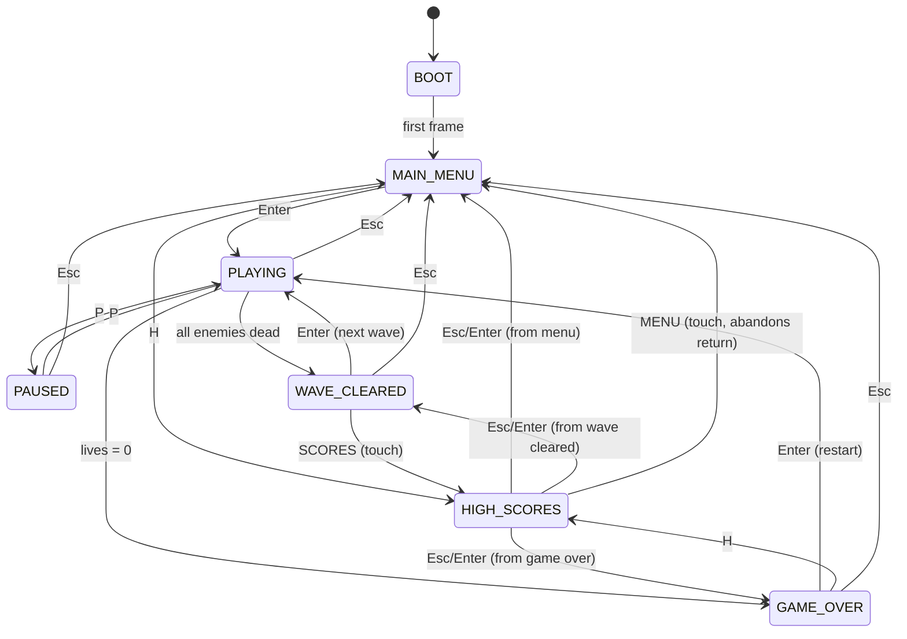

# NYC 212 Invader — State Machine

## States

| State | Description | Updates run? |
|---|---|---|
| `BOOT` | Initial frame; immediately advances to menu | No |
| `MAIN_MENU` | Title screen; game waits for player | No |
| `PLAYING` | Active gameplay | Yes |
| `PAUSED` | Game frozen | No |
| `WAVE_CLEARED` | All enemies destroyed; between waves | No |
| `GAME_OVER` | Lives exhausted | No |
| `HIGH_SCORES` | Local score history overlay | No |

## Transition Diagram

## Input Matrix

| State | Enter | P | Space | H | Esc |
|---|---|---|---|---|---|
| `MAIN_MENU` | Start game | — | — | High scores | — |
| `PLAYING` | — | Pause | Shoot | — | Main menu |
| `PAUSED` | — | Resume | — | — | Main menu |
| `WAVE_CLEARED` | Next wave | — | — | — | Main menu |
| `GAME_OVER` | Restart | — | — | High scores | Main menu |
| `HIGH_SCORES` | Return | — | — | — | Return |

## `returnState` for High Scores

When opening high scores, the game stores where to return via `highScoresReturnState()`:

- From `MAIN_MENU` → return to `MAIN_MENU`
- From `GAME_OVER` → return to `GAME_OVER`
- From `WAVE_CLEARED` → return to `WAVE_CLEARED` (touch SCORES)

`Esc`, `Enter`, or OK on high scores restores `returnState`. Touch MENU from high scores resets the session and returns to `MAIN_MENU`.

## Implementation Notes

- State stored on `session.state` (`GameState` type)
- Transitions via `transitionTo(next)` in `App.tsx`
- Only `PLAYING` calls `updatePlaying()`
- `BOOT` exists for clarity and future loading screens (assets, auth)
- Game **does not** auto-start; player must press Enter on main menu
- `Esc` to main menu calls `returnToMainMenu()` — resets score, lives, wave, and entities (in-progress run is abandoned)

## Invalid Transitions

These are ignored (no-op):

- Shooting on menu, pause, or overlay screens
- Pause on game over or wave cleared
- Movement keys outside `PLAYING`

## Future States (Not Implemented)

| State | Purpose |
|---|---|
| `LOADING` | Asset fetch progress |
| `SETTINGS` | Audio, controls |
| `CONNECT_WALLET` | Optional Solana (v0.6+) |
| `SUBMIT_SCORE` | Server validation flow |
